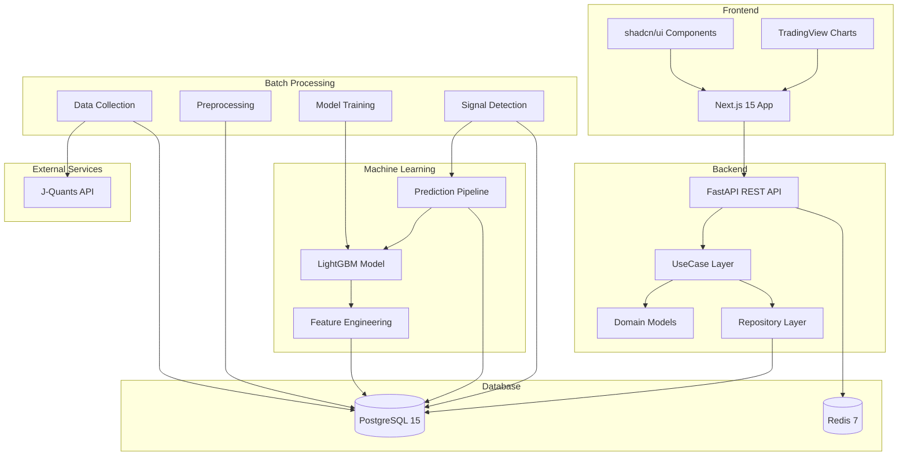
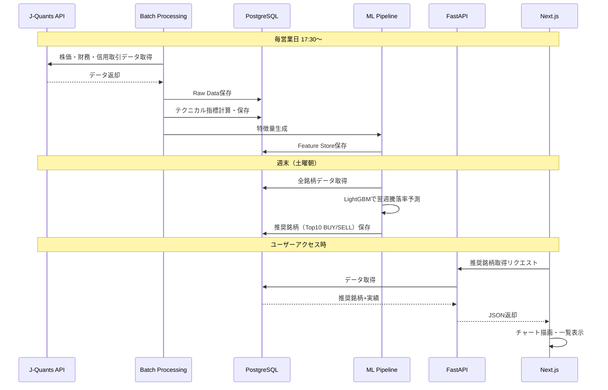

# プラチナの斧（platinum-axe）

[](https://opensource.org/licenses/MIT)
[](https://www.python.org/)
[](https://nodejs.org/)
[](https://fastapi.tiangolo.com/)
[](https://nextjs.org/)

**個人投資家にクオンツ分析 × AI によるデータ・ドリブンな株取引を**

J-Quants APIを活用した機械学習（勾配ブースティング）による日本株銘柄推奨システム。週次ラウンド制で買い推奨・売り推奨を各Top10銘柄提示し、デイリー強シグナル検出により投資判断を支援します。

> **⚠️ 注意**: このプロジェクトは現在**開発中**です。
> - Frontend/Backendの基本機能は実装済み（銘柄詳細ページv1完成）
> - **機械学習（ML）部分は未実装**です（設計のみ、コード未commit）
> - バッチ処理も未実装です

---

## ✨ 主要機能

- **📊 週次ラウンド制**: 毎週月曜〜金曜の期間で買い推奨・売り推奨を各Top10銘柄提示
- **⚡ デイリー強シグナル**: 毎営業日17:30以降に緊急買い/売りシグナルを検出
- **🤖 機械学習予測**: LightGBM（勾配ブースティング）による翌週騰落率予測
- **📈 パフォーマンス追跡**: 過去の推奨銘柄の実績を自動検証・可視化
- **📉 テクニカル分析**: 125種類のテクニカル指標を事前計算・チャート表示
- **🔍 銘柄詳細分析**: 株価チャート・推奨履歴・予測vs実績の可視化

---

## 📸 スクリーンショット

### メインページ（推奨銘柄一覧）


### 銘柄詳細ページ（株価チャート）


## 🏗️ システム構成



### データフロー



---

## 🛠️ 技術スタック

### Frontend
- **Framework**: Next.js 15 (App Router) + React 19
- **Language**: TypeScript
- **Styling**: Tailwind CSS v4
- **UI Components**: shadcn/ui
- **Data Fetching**: TanStack Query
- **Charts**: TradingView Lightweight Charts v5.2.0
- **API Client**: @hey-api/openapi-ts（OpenAPI自動生成）
- **Linter/Formatter**: Biome 2.5+
- **Package Manager**: pnpm

### Backend
- **Framework**: FastAPI 0.115
- **Language**: Python 3.12
- **ORM**: SQLAlchemy 2.0
- **Migration**: Alembic
- **Architecture**: Domain-Driven Design（4層構造）
- **Linter/Formatter**: Ruff 0.8+
- **Package Manager**: uv

### Database
- **RDBMS**: PostgreSQL 15
- **Cache**: Redis 7

### Machine Learning
- **Algorithm**: LightGBM（勾配ブースティング）
- **Libraries**: pandas, numpy, scikit-learn
- **Notebook**: Jupyter

### Infrastructure
- **Development**: VSCode DevContainer + Docker Compose
- **Deployment**: GCP（予定）

---

## 🚀 クイックスタート

### 前提条件

- Docker Desktop
- VSCode + Dev Containers拡張機能

### 環境構築（DevContainer）

1. **リポジトリをクローン**

```bash
git clone https://github.com/hirhiguc-moica/platinum-axe.git
cd platinum-axe
```

2. **VSCodeでDevContainerを起動**

```bash
code .
```

VSCodeで「Reopen in Container」を選択（または Command Palette → "Dev Containers: Reopen in Container"）

3. **環境変数を設定**

```bash
cp backend/.env.example backend/.env
# .envを編集してJ-Quants API認証情報等を設定
```

4. **データベースマイグレーション**

```bash
cd backend
uv run alembic upgrade head
```

5. **モックデータ投入**

```bash
uv run python scripts/seed_mock_data.py
uv run python scripts/seed_sectors.py
uv run python scripts/seed_markets.py
uv run python scripts/seed_stock_prices.py
```

6. **Backend起動**

```bash
uv run uvicorn app.main:app --reload --host 0.0.0.0 --port 8000
```

7. **Frontend起動（別ターミナル）**

```bash
cd frontend
pnpm install
pnpm dev
```

8. **アクセス**

- Frontend: http://localhost:3000
- Backend API: http://localhost:8000
- Swagger UI: http://localhost:8000/docs

---

## 📚 ドキュメント

詳細な設計・仕様は[docs/](./docs/)ディレクトリに集約されています。

### 主要ドキュメント

| ドキュメント | 内容 |
|------------|------|
| [CLAUDE.md](./CLAUDE.md) | プロジェクト概要・作業ルール |
| [docs/README.md](./docs/README.md) | ドキュメント索引（全体マップ） |
| [docs/project-overview.md](./docs/project-overview.md) | プロジェクト詳細・システム設計 |
| [docs/database/schemas.md](./docs/database/schemas.md) | 全テーブル定義（24テーブル） |
| [docs/backend/structure.md](./docs/backend/structure.md) | Backend DDD構造 |
| [docs/frontend/structure.md](./docs/frontend/structure.md) | Frontend構造 |
| [docs/infrastructure/local-development.md](./docs/infrastructure/local-development.md) | DevContainer使い方 |

### カテゴリ別ドキュメント

- **アーキテクチャ**: [docs/architecture/](./docs/architecture/)
- **Backend仕様**: [docs/backend/](./docs/backend/)
- **Frontend仕様**: [docs/frontend/](./docs/frontend/)
- **機械学習**: [docs/ml/](./docs/ml/)
- **バッチ処理**: [docs/batch/](./docs/batch/)
  - **[バッチ処理実行ガイド](./docs/batch/execution-guide.md)** - 全量取得・日次差分コマンド、GCP設定例
- **インフラ**: [docs/infrastructure/](./docs/infrastructure/)

---

## 📂 ディレクトリ構成

```
platinum-axe/
├── frontend/                    # Next.js Web Application
│   ├── app/                    # Next.js App Router
│   │   ├── _components/        # 共通コンポーネント
│   │   ├── stocks/             # 銘柄詳細ページ
│   │   └── [filter]/           # 推奨銘柄一覧ページ
│   ├── generated/              # OpenAPI自動生成型定義
│   └── lib/                    # ユーティリティ
│
├── backend/                     # FastAPI REST API
│   ├── app/
│   │   ├── domain/             # ドメインモデル
│   │   ├── usecase/            # ユースケース層
│   │   ├── infrastructure/     # インフラ層（DB・外部API）
│   │   ├── presentation/       # プレゼンテーション層（API）
│   │   └── shared/             # 共通設定
│   ├── alembic/                # DBマイグレーション
│   └── scripts/                # スクリプト（seed等）
│
├── ml/                          # 機械学習（未実装）
│   ├── notebooks/              # Jupyter Notebook
│   ├── features/               # 特徴量エンジニアリング
│   ├── models/                 # モデル学習・保存
│   └── evaluation/             # モデル評価
│
├── batch/                       # バッチ処理（未実装）
│   ├── data_collection/        # J-Quants APIデータ収集
│   ├── preprocessing/          # テクニカル指標計算
│   ├── model_training/         # モデル再学習
│   └── prediction/             # 週次推論・シグナル検出
│
├── docs/                        # ドキュメント
│   ├── architecture/           # アーキテクチャ設計
│   ├── backend/                # Backend仕様
│   ├── frontend/               # Frontend仕様
│   ├── ml/                     # 機械学習仕様
│   ├── batch/                  # バッチ仕様
│   ├── database/               # DB設計
│   └── infrastructure/         # インフラ
│
└── .devcontainer/               # VSCode DevContainer設定
    ├── Dockerfile
    ├── docker-compose.yml
    └── devcontainer.json
```

詳細は[docs/directory-structure.md](./docs/directory-structure.md)を参照。

---

## 🗃️ データベース設計

### 4層レイヤー構造

```
Layer 1: Raw Data（トランザクションデータ）
  └─ J-Quants APIから取得した生データ
     - stock_prices_daily（株価四本値）
     - financial_statements（財務諸表）
     - margin_trading_daily/weekly（信用取引）
     - stock_master（銘柄マスタ）

Layer 2: Derived Data（計算済みデータ）
  └─ テクニカル指標を事前計算
     - technical_indicators（125種類の指標）

Layer 3: Feature Store（機械学習用特徴量）
  └─ モデル学習・推論用に最適化
     - ml_features（全特徴量JSONB）

Layer 4: Prediction & Result（予測・結果）
  └─ ラウンド推奨・シグナル・実績
     - rounds（ラウンド管理）
     - round_recommendations（推奨銘柄）
     - round_results（結果検証）
     - daily_signals（デイリーシグナル）
```

詳細は[docs/database/schemas.md](./docs/database/schemas.md)を参照。

---

## 🔄 週次ワークフロー

```
【毎営業日 17:30〜18:00】
└─ J-Quants APIから株価・財務・信用取引データ取得 → DB保存

【毎営業日 18:00〜18:30】
├─ テクニカル指標計算 → DB保存
└─ 機械学習特徴量生成 → DB保存

【毎営業日 18:30〜19:00】
└─ デイリー強シグナル検出 → DB保存

【週末（土曜朝）】
├─ 今週のラウンド結果検証 → パフォーマンス計算
└─ 来週のラウンド推奨銘柄算出（買い/売り Top10）

【月曜朝】
└─ 新ラウンド開始 → Webサイトに推奨銘柄表示
```

---

## 🧪 開発

### Backend開発

```bash
cd backend

# 依存関係インストール
uv sync

# サーバー起動（ホットリロード）
uv run uvicorn app.main:app --reload

# マイグレーション作成
uv run alembic revision --autogenerate -m "description"

# マイグレーション実行
uv run alembic upgrade head

# Linter/Formatter（Ruff）
uv run ruff check .              # Lintチェック
uv run ruff check --fix .        # Lint自動修正
uv run ruff format .             # フォーマット

# テスト実行
uv run pytest
```

### Frontend開発

```bash
cd frontend

# 依存関係インストール
pnpm install

# 開発サーバー起動
pnpm dev

# OpenAPI型生成（Backend起動後）
pnpm openapi-ts

# Linter/Formatter（Biome）
pnpm lint                        # Lintチェック
pnpm lint:fix                    # Lint自動修正
pnpm format                      # フォーマットのみ
pnpm typecheck                   # 型チェック
pnpm check                       # Lint + 型チェック（commit前推奨）

# ビルド
pnpm build
```

### Container上からのコマンド実行

DevContainer外（ホスト側）からコマンドを実行する場合：

```bash
# Backendコマンド（vscodeユーザーでログインシェル必須）
docker exec -u vscode platinum-axe_devcontainer-app-1 bash -l -c "cd /workspace/backend && uv run ruff check --fix ."
docker exec -u vscode platinum-axe_devcontainer-app-1 bash -l -c "cd /workspace/backend && uv run ruff format ."

# Frontendコマンド（vscodeユーザーでログインシェル必須）
docker exec -u vscode platinum-axe_devcontainer-app-1 bash -l -c "cd /workspace/frontend && pnpm lint:fix"
docker exec -u vscode platinum-axe_devcontainer-app-1 bash -l -c "cd /workspace/frontend && pnpm check"
```

> **Note**: `bash -l` (ログインシェル) が必要です。これにより環境変数（PATH等）が正しく読み込まれます。

---

## 📊 データソース

### J-Quants API Standardプラン

- **料金**: ¥3,300/月
- **データ期間**: 過去10年分
- **取得データ**:
  - ✅ 株価四本値（OHLC、調整済み株価）
  - ✅ 財務情報サマリー（PER, PBR, ROE等）
  - ✅ 信用取引データ（日々公表残高含む）
  - ✅ 指数データ（TOPIX等）
  - ✅ 上場銘柄マスタ

詳細は[docs/ml/data-sources.md](./docs/ml/data-sources.md)を参照（作成予定）。

---

## 🤝 コントリビューション

現在はプライベートプロジェクトですが、将来的にオープンソース化を検討中です。

### 開発フロー

1. Issue作成
2. feature/xxx ブランチ作成
3. 実装・テスト
4. Pull Request作成
5. レビュー・マージ

---

## 📄 ライセンス

MIT License

---

## 📞 問い合わせ

プロジェクトに関する質問・提案は[Issues](https://github.com/hirhiguc-moica/platinum-axe/issues)までお願いします。

---

## 🙏 謝辞

- **J-Quants**: 日本株データAPI提供
- **TradingView**: Lightweight Chartsライブラリ
- **shadcn/ui**: UIコンポーネントライブラリ

---

**最終更新**: 2026-07-22
