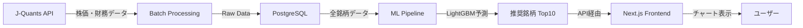

# プラチナの斧 - ドキュメント索引

このディレクトリには、プラチナの斧（platinum-axe）プロジェクトの設計ドキュメントが格納されています。

> **⚠️ 注意**: このプロジェクトは現在**開発中**です。
> - Frontend/Backendの基本機能は実装済み（銘柄詳細ページv1完成）
> - **機械学習（ML）部分は未実装**です（設計のみ、コード未commit）
> - バッチ処理も未実装です

---

## 🚀 5分で理解するクイックツアー

### システムの核心

プラチナの斧は**週次ラウンド制**の日本株推奨システムです。



### データフロー（週次サイクル）

```
【毎営業日 17:30】
J-Quants API → Batch → PostgreSQL（株価・テクニカル指標）

【週末（土曜朝）】
PostgreSQL → ML Pipeline → LightGBM予測 → 推奨銘柄Top10を保存

【月曜朝〜金曜】
ユーザーアクセス → FastAPI → PostgreSQL → Next.js（チャート表示）

【翌週月曜】
先週の推奨結果を自動検証 → パフォーマンス計算
```

### 最初に読むべきドキュメント

1. **[project-overview.md](./project-overview.md)** - システムの全体像（10分）
2. **[directory-structure.md](./directory-structure.md)** - コードベース構造（5分）
3. **[database/schemas.md](./database/schemas.md)** - DB設計（15分）

---

## 👥 ロールベースガイド

### Frontend開発者向け

**あなたがやること**: Next.js/React/TypeScriptでUIを実装

**最初に読むべきドキュメント**:
1. ✅ [frontend/structure.md](./frontend/structure.md) - Frontend構造（shadcn/ui, TanStack Query）
2. ✅ [frontend/coding-style.md](./frontend/coding-style.md) - コーディング規約
3. ✅ [infrastructure/local-development.md](./infrastructure/local-development.md) - DevContainer環境

**API型定義の生成方法**:
```bash
cd frontend
pnpm openapi-ts  # Backend起動後に実行
```

**よく使うコマンド**:
```bash
pnpm dev        # 開発サーバー起動
pnpm build      # ビルド
pnpm lint       # Lintチェック
```

---

### Backend開発者向け

**あなたがやること**: FastAPI/SQLAlchemy/AlembicでREST APIとDB設計

**最初に読むべきドキュメント**:
1. ✅ [backend/structure.md](./backend/structure.md) - DDD 4層構造
2. ✅ [backend/coding-style.md](./backend/coding-style.md) - コーディング規約
3. ✅ [database/schemas.md](./database/schemas.md) - 全テーブル定義（⭐最重要）
4. ✅ [database/guidelines.md](./database/guidelines.md) - DB設計ガイドライン

**DDD 4層構造の責務**:
```
presentation/ → ルーティング、リクエスト/レスポンス変換
usecase/      → ビジネスロジック、トランザクション管理
domain/       → ドメインモデル（SQLAlchemy）
infrastructure/ → DB接続、外部API連携
```

**よく使うコマンド**:
```bash
uv run uvicorn app.main:app --reload           # サーバー起動
uv run alembic revision --autogenerate -m "xxx"  # マイグレーション作成
uv run alembic upgrade head                    # マイグレーション実行
uv run pytest                                  # テスト実行
```

---

### ML/データサイエンティスト向け

**あなたがやること**: LightGBMモデル設計、特徴量エンジニアリング

**最初に読むべきドキュメント**:
1. ✅ [ml/features.md](./ml/features.md) - 特徴量設計（⭐最重要、作成予定）
2. ✅ [ml/models.md](./ml/models.md) - LightGBMモデル設計（作成予定）
3. ✅ [ml/data-sources.md](./ml/data-sources.md) - J-Quants API仕様（作成予定）
4. ✅ [batch/preprocessing.md](./batch/preprocessing.md) - テクニカル指標計算（作成予定）

**データレイヤー構造**:
```
Layer 1: Raw Data（株価・財務・信用取引）
   ↓
Layer 2: Derived Data（テクニカル指標125種類）
   ↓
Layer 3: Feature Store（ML用特徴量JSONB）
   ↓
Layer 4: Prediction（推奨銘柄・シグナル）
```

**よく使うコマンド**:
```bash
jupyter lab                          # Notebook起動
uv run python ml/train.py            # モデル学習
uv run python batch/predict.py       # 週次推論
```

---

## 📖 実践的なユースケース集

### ユースケース1: 新しいAPIエンドポイントを追加したい

**シナリオ**: `GET /api/v1/sectors`（業種一覧取得API）を追加

**手順**:

1. **Domain Modelを確認/作成**
   ```python
   # backend/app/domain/models/sector.py
   # すでに存在する場合はスキップ
   ```

2. **Repositoryを作成**
   ```python
   # backend/app/infrastructure/repositories/sector_repository.py
   class SectorRepository:
       async def find_all(self) -> list[Sector]:
           ...
   ```

3. **UseCaseを作成**
   ```python
   # backend/app/usecase/get_sectors.py
   class GetSectorsUseCase:
       def __init__(self, repo: SectorRepository):
           self.repo = repo

       async def execute(self) -> list[Sector]:
           return await self.repo.find_all()
   ```

4. **API Routerを作成**
   ```python
   # backend/app/presentation/api/v1/sectors.py
   from app.usecase.get_sectors import GetSectorsUseCase

   @router.get("/sectors")
   async def get_sectors():
       usecase = GetSectorsUseCase(...)
       return await usecase.execute()
   ```

5. **main.pyに登録**
   ```python
   # backend/app/main.py
   from app.presentation.api.v1 import sectors
   app.include_router(sectors.router, prefix="/api/v1", tags=["sectors"])
   ```

6. **Frontendで型生成**
   ```bash
   cd frontend
   pnpm openapi-ts
   ```

**参照ドキュメント**:
- [backend/structure.md](./backend/structure.md)
- [backend/development-guide.md](./backend/development-guide.md)（作成予定）

---

### ユースケース2: 新しいページを追加したい

**シナリオ**: `/sectors`（業種別ランキングページ）を追加

**手順**:

1. **ディレクトリ作成**
   ```bash
   mkdir -p frontend/app/sectors
   ```

2. **ページファイル作成**
   ```tsx
   // frontend/app/sectors/page.tsx
   import { getSectors } from '@/generated/sdk.gen'

   export default async function SectorsPage() {
     const { data } = await getSectors()
     return <div>...</div>
   }
   ```

3. **Headerにリンク追加**
   ```tsx
   // frontend/app/_components/Header.tsx
   <Link href="/sectors">業種別</Link>
   ```

4. **動作確認**
   ```
   http://localhost:3000/sectors
   ```

**参照ドキュメント**:
- [frontend/structure.md](./frontend/structure.md)
- [frontend/coding-style.md](./frontend/coding-style.md)

---

### ユースケース3: 新しいテーブルを追加したい

**シナリオ**: `user_watchlists`（ユーザーのウォッチリスト）テーブル追加

**手順**:

1. **DB設計ガイドライン確認**
   - [database/guidelines.md](./database/guidelines.md) を読む
   - UUID主キー、TimestampMixin使用を確認

2. **Domain Modelを作成**
   ```python
   # backend/app/domain/models/user_watchlist.py
   from app.domain.models.base import Base, TimestampMixin
   import uuid

   class UserWatchlist(Base, TimestampMixin):
       __tablename__ = "user_watchlists"

       id = Column(UUID, primary_key=True, server_default=text("gen_random_uuid()"))
       user_id = Column(String, nullable=False)
       stock_code = Column(String(4), ForeignKey("stock_master.stock_code"))
       # ... その他のカラム
   ```

3. **Alembicマイグレーション作成**
   ```bash
   cd backend
   uv run alembic revision --autogenerate -m "add user_watchlists table"
   ```

4. **マイグレーション内容を確認・修正**
   ```python
   # backend/alembic/versions/xxxxx_add_user_watchlists_table.py
   # インデックス追加等を手動で調整
   ```

5. **マイグレーション実行**
   ```bash
   uv run alembic upgrade head
   ```

6. **schemas.mdに追記**
   - [database/schemas.md](./database/schemas.md) にテーブル定義を追記

**参照ドキュメント**:
- [database/schemas.md](./database/schemas.md)
- [database/guidelines.md](./database/guidelines.md)

---

### ユースケース4: 新しい特徴量を追加したい

**シナリオ**: VWAP（出来高加重平均価格）を特徴量に追加

**手順**:

1. **特徴量設計を確認**
   - [ml/features.md](./ml/features.md)（作成予定）を確認
   - 既存の特徴量との重複チェック

2. **technical_indicatorsテーブルにカラム追加**
   ```python
   # backend/app/domain/models/technical_indicator.py
   vwap_5 = Column(Float, nullable=True, comment="5日VWAP")
   vwap_20 = Column(Float, nullable=True, comment="20日VWAP")
   ```

3. **Alembicマイグレーション**
   ```bash
   uv run alembic revision --autogenerate -m "add vwap features"
   uv run alembic upgrade head
   ```

4. **計算ロジック実装**
   ```python
   # batch/preprocessing/calculate_technical_indicators.py
   def calculate_vwap(df, period=5):
       df['vwap'] = (df['close'] * df['volume']).rolling(period).sum() / df['volume'].rolling(period).sum()
       return df
   ```

5. **特徴量ドキュメント更新**
   - [ml/features.md](./ml/features.md) にVWAPの説明を追記

**参照ドキュメント**:
- [ml/features.md](./ml/features.md)（作成予定）
- [database/schemas.md](./database/schemas.md)
- [batch/preprocessing.md](./batch/preprocessing.md)（作成予定）

---

## 🛠️ トラブルシューティング

### DevContainer関連

**問題**: DevContainerが起動しない

**解決方法**:
1. Docker Desktopが起動しているか確認
2. `.devcontainer/docker-compose.yml`でポート競合チェック
3. VSCode拡張機能「Dev Containers」がインストール済みか確認
4. [infrastructure/local-development.md](./infrastructure/local-development.md) を参照

---

### Database関連

**問題**: `alembic upgrade head`で失敗する

**解決方法**:
1. PostgreSQLが起動しているか確認
   ```bash
   docker ps | grep postgres
   ```
2. `.env`の`DATABASE_URL`が正しいか確認
3. マイグレーションファイルの内容を確認
   ```bash
   cat backend/alembic/versions/xxxxx_*.py
   ```

**問題**: テーブルが見つからない

**解決方法**:
1. マイグレーションが実行されているか確認
   ```bash
   uv run alembic current
   ```
2. PostgreSQLに接続してテーブル確認
   ```bash
   docker exec -it platinum-axe-db-1 psql -U postgres -d platinum_axe
   \dt
   ```

---

### API関連

**問題**: `GET /api/v1/xxx`で500エラー

**解決方法**:
1. Backendのログを確認
   ```bash
   # DevContainer内で
   uv run uvicorn app.main:app --reload
   ```
2. Swagger UIで動作確認
   ```
   http://localhost:8000/docs
   ```
3. `infrastructure/database.py`のDB接続確認

---

### Frontend関連

**問題**: OpenAPI型生成がエラーになる

**解決方法**:
1. Backendが起動しているか確認
   ```bash
   curl http://localhost:8000/openapi.json
   ```
2. `openapi-ts.config.ts`の設定確認
3. 再生成
   ```bash
   rm -rf frontend/generated
   pnpm openapi-ts
   ```

---

## ❓ FAQ（よくある質問）

### Q1: なぜDDD（ドメイン駆動設計）を採用したのか？

**A**: 以下の理由からDDD 4層構造を採用しました：

- **責務の明確化**: presentation/usecase/domain/infrastructureで関心事を分離
- **テスタビリティ**: 各層を独立してテスト可能
- **保守性**: ビジネスロジックがusecaseに集約され、変更が容易
- **拡張性**: 新機能追加時に既存コードへの影響を最小化

詳細: [backend/structure.md](./backend/structure.md)

---

### Q2: なぜUUID主キーを採用したのか？

**A**: 以下の利点からUUID主キーを採用：

- **分散システム対応**: 将来的な水平スケーリングに対応
- **セキュリティ**: 連番IDと異なり推測困難
- **外部連携**: 外部システムとのID衝突リスクがない
- **マイグレーション**: データ移行時にID再採番不要

詳細: [database/guidelines.md](./database/guidelines.md)

---

### Q3: なぜテクニカル指標をDB事前計算するのか？

**A**: パフォーマンスと監査性の両立のため：

- **高速推論**: 毎回計算せずDB取得のみで高速化
- **一貫性**: 全銘柄で同一ロジックで計算済み
- **監査可能**: 過去のテクニカル指標を再現可能
- **デバッグ容易**: DBクエリで直接確認可能

詳細: [database/schemas.md](./database/schemas.md)

---

### Q4: なぜJ-Quants API Standardプランを選んだのか？

**A**: コスト効率と将来性のバランスから：

- **コスト**: ¥3,300/月（Premium比で年間¥158,400節約）
- **十分なデータ**: 株価・財務・信用取引データが揃う
- **移行容易**: Standard→Premium移行が簡単
- **段階的アップグレード**: 実績検証後に判断可能

詳細: CLAUDE.md（J-Quants API仕様セクション）

---

### Q5: なぜTurborepoを使わないのか？

**A**: アプリが1つのみのため不要と判断：

- **モノレポ**: frontend/backend/ml/batchを1リポジトリ管理
- **単一アプリ**: Webアプリ1つのみ（複数アプリなし）
- **シンプル**: Turborepoの複雑性を避ける
- **将来拡張**: モバイルアプリ追加時にTurborepo導入を検討

詳細: [directory-structure.md](./directory-structure.md)

---

### Q6: shadcn/uiを選んだ理由は？

**A**: 柔軟性とカスタマイズ性を重視：

- **コピペ型**: ライブラリ依存ではなくコード所有
- **Tailwind CSS連携**: Tailwind v4とシームレス統合
- **軽量**: 必要なコンポーネントのみ追加
- **カスタマイズ容易**: コードを直接編集可能

詳細: [frontend/structure.md](./frontend/structure.md)

---

## 📚 ドキュメント一覧

### プロジェクト全体

| ドキュメント | 内容 | 重要度 |
|------------|------|--------|
| [project-overview.md](./project-overview.md) | プロジェクト概要・目的・機能詳細 | ⭐⭐⭐ |
| [directory-structure.md](./directory-structure.md) | モノレポ構成・ディレクトリ配置ルール | ⭐⭐⭐ |

### アーキテクチャ

| ドキュメント | 内容 | 重要度 |
|------------|------|--------|
| [architecture/system-architecture.md](./architecture/system-architecture.md) | システム全体アーキテクチャ・コンポーネント図 | ⭐⭐⭐ |
| [architecture/data-pipeline.md](./architecture/data-pipeline.md) | データパイプライン設計（データフロー） | ⭐⭐ |
| [architecture/ml-workflow.md](./architecture/ml-workflow.md) | 機械学習ワークフロー（学習・推論） | ⭐⭐ |

### データベース

| ドキュメント | 内容 | 重要度 |
|------------|------|--------|
| [database/schemas.md](./database/schemas.md) | **全テーブル定義（最重要）** | ⭐⭐⭐ |
| [database/guidelines.md](./database/guidelines.md) | DB設計ガイドライン・命名規則 | ⭐⭐ |

### Backend

| ドキュメント | 内容 | 重要度 |
|------------|------|--------|
| [backend/structure.md](./backend/structure.md) | Backend DDD構造・層の責務 | ⭐⭐⭐ |
| [backend/coding-style.md](./backend/coding-style.md) | コーディング規約（Python/FastAPI） | ⭐⭐ |
| [backend/development-guide.md](./backend/development-guide.md) | 開発手順・テスト方法 | ⭐⭐ |
| [backend/api-specification.md](./backend/api-specification.md) | REST API仕様 | ⭐ |

### Frontend

| ドキュメント | 内容 | 重要度 |
|------------|------|--------|
| [frontend/structure.md](./frontend/structure.md) | Frontend構造（Next.js/shadcn/ui） | ⭐⭐⭐ |
| [frontend/coding-style.md](./frontend/coding-style.md) | コーディング規約（TypeScript/React） | ⭐⭐ |
| [frontend/user-guide.md](./frontend/user-guide.md) | 一般ユーザー向け使い方ガイド | ⭐ |
| [frontend/environment.md](./frontend/environment.md) | 環境変数管理 | ⭐ |

### 機械学習

| ドキュメント | 内容 | 重要度 |
|------------|------|--------|
| [ml/data-sources.md](./ml/data-sources.md) | データソース（J-Quants API詳細） | ⭐⭐⭐ |
| [ml/features.md](./ml/features.md) | **特徴量設計（重要）** | ⭐⭐⭐ |
| [ml/models.md](./ml/models.md) | モデル設計（LightGBM設定） | ⭐⭐ |
| [ml/training-pipeline.md](./ml/training-pipeline.md) | 学習パイプライン・評価手法 | ⭐⭐ |

### バッチ処理

| ドキュメント | 内容 | 重要度 |
|------------|------|--------|
| [batch/data-collection.md](./batch/data-collection.md) | データ収集バッチ（J-Quants API取得） | ⭐⭐ |
| [batch/preprocessing.md](./batch/preprocessing.md) | 前処理バッチ（テクニカル指標計算） | ⭐⭐ |
| [batch/prediction.md](./batch/prediction.md) | 予測バッチ（ラウンド推奨・シグナル検出） | ⭐⭐ |

### インフラストラクチャ

| ドキュメント | 内容 | 重要度 |
|------------|------|--------|
| [infrastructure/local-development.md](./infrastructure/local-development.md) | ローカル開発環境（DevContainer） | ⭐⭐⭐ |
| [infrastructure/deployment.md](./infrastructure/deployment.md) | デプロイ手順（GCP） | ⭐⭐ |
| [infrastructure/monitoring.md](./infrastructure/monitoring.md) | 監視・ログ設計 | ⭐ |

**重要度の意味**:
- ⭐⭐⭐ **最重要** - 必ず読むべきドキュメント
- ⭐⭐ **重要** - 実装前に確認推奨
- ⭐ **参考** - 必要に応じて参照

---

## 🎓 学習パス

### 初心者向け（環境構築→基本理解）

**目標**: ローカル環境でアプリケーションを起動できる

1. **環境構築** (30分)
   - [infrastructure/local-development.md](./infrastructure/local-development.md)
   - DevContainerでPostgreSQL/Redis起動
   - Backend/Frontend起動

2. **システム全体理解** (20分)
   - [project-overview.md](./project-overview.md)
   - [directory-structure.md](./directory-structure.md)

3. **実際に動かしてみる** (10分)
   - http://localhost:3000 でFrontend確認
   - http://localhost:8000/docs でSwagger UI確認
   - RecommendationCard をクリックして銘柄詳細ページへ

---

### 中級者向け（実装→テスト）

**目標**: 新しい機能を実装できる

1. **担当領域の深堀り** (60分)
   - Frontend: [frontend/structure.md](./frontend/structure.md) + [frontend/coding-style.md](./frontend/coding-style.md)
   - Backend: [backend/structure.md](./backend/structure.md) + [database/schemas.md](./database/schemas.md)
   - ML: [ml/features.md](./ml/features.md) + [ml/models.md](./ml/models.md)（作成予定）

2. **ユースケース実践** (120分)
   - 「新しいAPIエンドポイント追加」を実際に試す
   - 「新しいページ追加」を実際に試す
   - テストを書く（作成予定: backend/development-guide.md）

3. **コードレビュー** (30分)
   - 既存のコードを読む
   - コーディング規約に準拠しているか確認

---

### 上級者向け（アーキテクチャ変更）

**目標**: システム設計を改善できる

1. **アーキテクチャ理解** (90分)
   - [architecture/system-architecture.md](./architecture/system-architecture.md)（作成予定）
   - [architecture/data-pipeline.md](./architecture/data-pipeline.md)（作成予定）
   - [architecture/ml-workflow.md](./architecture/ml-workflow.md)（作成予定）

2. **設計判断の理由を理解** (60分)
   - FAQセクションを全て読む
   - 各ドキュメントの「設計の意図」セクションを読む

3. **改善提案** (∞)
   - パフォーマンス改善
   - スケーラビリティ改善
   - 新機能提案
   - [Issues](https://github.com/hirhiguc-moica/platinum-axe/issues)で議論

---

## 🔍 ドキュメントの探し方

### 目的別

| やりたいこと | 参照ドキュメント |
|------------|----------------|
| プロジェクト全体を理解したい | `project-overview.md` |
| 環境構築したい | `infrastructure/local-development.md` |
| テーブルを追加したい | `database/schemas.md`, `database/guidelines.md` |
| APIを追加したい | `backend/structure.md`, `backend/development-guide.md` |
| ページを追加したい | `frontend/structure.md`, `frontend/coding-style.md` |
| 特徴量を追加したい | `ml/features.md` |
| バッチを追加したい | `batch/` + `architecture/data-pipeline.md` |
| デプロイしたい | `infrastructure/deployment.md` |

### キーワード検索

| キーワード | ドキュメント |
|----------|------------|
| UUID主キー | `database/guidelines.md` |
| DDD構造 | `backend/structure.md` |
| shadcn/ui | `frontend/structure.md` |
| TanStack Query | `frontend/structure.md` |
| Alembic | `database/guidelines.md`, `backend/development-guide.md` |
| LightGBM | `ml/models.md` |
| J-Quants API | `ml/data-sources.md`, CLAUDE.md |
| DevContainer | `infrastructure/local-development.md` |

---

## 📝 ドキュメント更新ルール

### 更新が必要なタイミング

- ✅ 新機能を追加した時
- ✅ アーキテクチャを変更した時
- ✅ テーブル定義を変更した時
- ✅ API仕様を変更した時
- ✅ 重要な設計判断をした時
- ✅ バグ修正で設計が変わった時

### 更新方法

1. 該当ドキュメントを直接編集
2. 変更内容をコミットメッセージに記載
3. 関連ドキュメントも併せて更新（例: schemas.md更新 → guidelines.mdも確認）
4. Pull Requestで他メンバーにレビュー依頼

### ドキュメント作成ガイドライン

- **Markdown形式**: 必ずMarkdownで記述
- **見出し構造**: H1→H2→H3の階層を守る
- **コード例**: 必ず具体的なコード例を含める
- **図表**: Mermaidダイアグラムを活用
- **リンク**: 関連ドキュメントへのリンクを張る
- **更新日時**: ドキュメント末尾に最終更新日を記載

---

## 📂 ドキュメント構造

```
docs/
├── README.md                          # このファイル（索引）
├── project-overview.md                # プロジェクト概要
├── directory-structure.md             # モノレポ構成
│
├── architecture/                      # アーキテクチャ設計
│   ├── system-architecture.md         # システム全体
│   ├── data-pipeline.md               # データパイプライン
│   └── ml-workflow.md                 # ML ワークフロー
│
├── backend/                           # Backend仕様
│   ├── structure.md                   # DDD構造
│   ├── coding-style.md                # コーディング規約
│   ├── development-guide.md           # 開発手順
│   └── api-specification.md           # API仕様
│
├── frontend/                          # Frontend仕様
│   ├── structure.md                   # 構造
│   ├── coding-style.md                # コーディング規約
│   ├── user-guide.md                  # ユーザーガイド
│   └── environment.md                 # 環境変数
│
├── ml/                                # 機械学習
│   ├── data-sources.md                # データソース
│   ├── features.md                    # 特徴量設計
│   ├── models.md                      # モデル設計
│   └── training-pipeline.md           # 学習パイプライン
│
├── batch/                             # バッチ処理
│   ├── data-collection.md             # データ収集
│   ├── preprocessing.md               # 前処理
│   └── prediction.md                  # 予測
│
├── database/                          # データベース
│   ├── schemas.md                     # テーブル定義
│   └── guidelines.md                  # 設計ガイドライン
│
└── infrastructure/                    # インフラ
    ├── local-development.md           # ローカル環境
    ├── deployment.md                  # デプロイ
    └── monitoring.md                  # 監視
```

---

## 🤝 コントリビューション

ドキュメントの改善提案は大歓迎です！

1. **誤字・脱字**: 直接Pull Request
2. **内容の追加**: Issueで議論 → Pull Request
3. **新規ドキュメント**: Issueで相談 → 承認後に作成

[Issues](https://github.com/hirhiguc-moica/platinum-axe/issues)へお気軽にどうぞ！

---

## 最終更新

- **日時**: 2026-07-22
- **変更内容**: ドキュメント索引を大幅強化（クイックツアー、ロールベースガイド、ユースケース集、トラブルシューティング、FAQ、学習パス追加）
